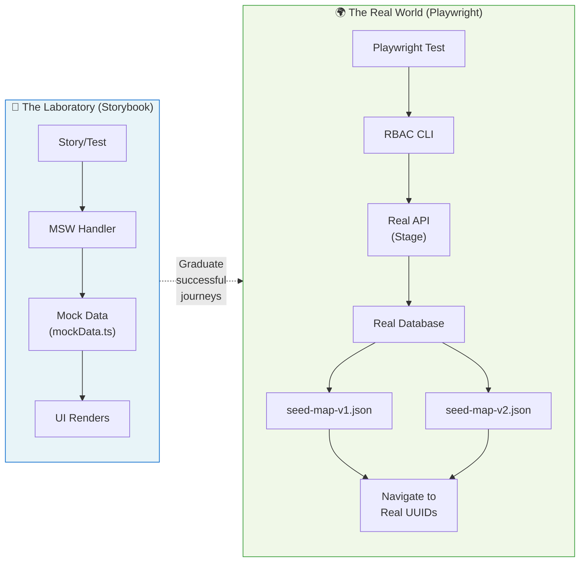
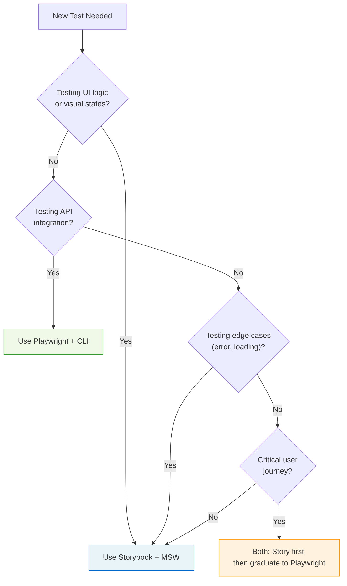

import { Meta } from '@storybook/addon-docs/blocks';

<Meta title="Documentation/E2E Testing Strategy" />

# E2E Testing Strategy

This document outlines our comprehensive testing approach—a dual-track strategy that combines the speed of mocked tests with the confidence of real end-to-end verification.

---

## 🧪 The Strategy: "The Laboratory vs. The Real World"

Our quality assurance relies on two complementary testing pillars, each optimized for different purposes:

### The Laboratory (Storybook + MSW)

> **Fast, deterministic, developer-focused.**

In the laboratory, we use **Mock Service Worker (MSW)** to intercept all network requests. This creates a controlled environment where:

- ✅ Tests run **instantly**—no network latency
- ✅ Every state is **reproducible**—loading, error, empty, success
- ✅ Developers get **immediate feedback** while coding
- ✅ Edge cases are **easy to simulate**—rate limits, timeouts, malformed data

**Best for testing:**
- How the UI handles different data states
- Component rendering and interactions
- Visual regression testing
- Accessibility verification

### The Real World (Playwright + CLI)

> **Full-stack integration, production confidence.**

In the real world, we use **Playwright** with our custom **RBAC CLI** to seed actual data into the staging environment. This validates:

- ✅ **API contracts**—the backend actually accepts what we send
- ✅ **Data persistence**—created resources exist and can be retrieved
- ✅ **Authentication flows**—sessions work end-to-end
- ✅ **Production readiness**—the complete system works together

**Best for testing:**
- CI/CD smoke tests before deployment
- Multi-step user journeys with real data
- Integration between frontend and backend
- Permission system verification

---

### Architecture Diagram



---

## 🌉 The Bridge: From Story to Spec

We follow a "progressive confidence" workflow:

1. **Build in Storybook** — Develop the UI with mocks, iterate quickly on design and edge cases
2. **Write Play Functions** — Add interaction tests that validate user journeys in the mocked environment
3. **Graduate to Playwright** — Once the journey is stable, create a real E2E spec using seeded data

This approach gives us the best of both worlds: rapid development velocity AND production confidence.

### Comparison Table

| Aspect | Storybook (MSW) | Playwright (CLI) |
|--------|-----------------|------------------|
| **Data Source** | `mockData.ts` handlers | `seed-map.json` from CLI |
| **Speed** | ⚡ Instant (~ms) | 🐢 Slower (~seconds for seed) |
| **Determinism** | 100% reproducible | Depends on environment state |
| **Best For** | DX, design, edge cases | CI/CD, smoke tests, contracts |
| **Network** | Intercepted by MSW | Real HTTP to staging |
| **Database** | None | Real staging database |
| **Setup Cost** | Zero | Requires auth + seed |
| **Debugging** | Storybook UI | Playwright trace viewer |

---

## 🛠️ The Tooling: `rbac-cli`

To make "The Real World" testing possible without flakiness, we built the **RBAC CLI**—a purpose-built tool that handles authentication and data management.

### Why We Need It

Traditional E2E tests suffer from:
- ❌ Hardcoded UUIDs that become stale
- ❌ Manual data setup that's error-prone
- ❌ Shared test data that causes conflicts
- ❌ No cleanup, leading to data pollution

The CLI solves these by providing:
- ✅ Automated authentication with storage state export
- ✅ Dynamic data seeding with UUID mapping
- ✅ Prefixed resources for isolation
- ✅ Safe cleanup with guardrails
- ✅ **Anti-Flake Layer** — Automatically blocks vendor consent overlays (TrustArc) to prevent false negatives

---

### Command Reference

#### `login --headless` — The Authentication Bridge

Performs automated SSO login and exports Playwright-compatible storage state.

Auth is now handled automatically by **Playwright setup projects**. When you run tests, Playwright's dependency system ensures authentication runs just before each persona's tests, keeping tokens fresh.

```bash
# Auth is automatic! Just run tests:
TEST_PREFIX_V1=jdoe npm run e2e:v1

# Or run directly with Playwright (auth setup runs automatically):
TEST_PREFIX_V1=jdoe npx playwright test --project=v1-admin
```

**Dual-Proxy Support:**

The CLI automatically handles two networking scenarios:

| Environment | Variable | Use Case |
|-------------|----------|----------|
| **CI Pipeline** | `HTTPS_PROXY` | Sidecar proxy in CI/CD |
| **Local VPN** | `RBAC_PAC_URL` | Corporate VPN PAC file |

```bash
# CI sidecar proxy
HTTPS_PROXY=http://sidecar:8080 npm run cli -- login --headless

# Local VPN (macOS: find your PAC URL with `scutil --proxy`)
NODE_TLS_REJECT_UNAUTHORIZED=0 \
RBAC_PAC_URL="https://proxy.corp.redhat.com/proxy.pac" \
npm run cli -- login --headless
```

---

#### `seed --file --prefix --json --output [--dry-run]` — Data Injection

Creates resources and outputs a name→UUID mapping for test navigation.

```bash
# V1 tests: seed roles and groups (no workspaces) → outputs seed-map-v1.json
TEST_PREFIX_V1=jdoe npm run e2e:v1:seed

# V2 tests: seed roles, groups, and workspaces → outputs seed-map-v2.json
TEST_PREFIX_V2=jdoe npm run e2e:v2:seed

# Dry-run: authenticates and discovers system resources, but skips mutations
TEST_PREFIX_V1=debug npm run cli -- seed --file e2e/fixtures/seed-v1.json --prefix "${TEST_PREFIX_V1}" --dry-run
```

**Dry-run behavior:**
- ✅ Authenticates to the API (validates credentials work)
- ✅ Discovers system roles and groups (Phase 1 runs normally)
- ❌ Skips resource creation (Phase 2 outputs curl commands instead)

This lets you verify the seed configuration and see available system resources without creating anything.

**Payload Schema (`e2e/fixtures/seed-v1.json`):**

```json
{
  "personas": {
    "admin": { "username": "rbac-e2e-admin-v1" },
    "readonly": { "username": "rbac-e2e-user-v1" }
  },
  "roles": [
    {
      "name": "analyst",
      "display_name": "Cost Analyst",
      "description": "Read-only access to cost data"
    }
  ],
  "groups": [
    {
      "name": "finance-team",
      "description": "Finance department users"
    }
  ]
}
```

**Output (`seed-map-v1.json` / `seed-map-v2.json`):**

V1 and V2 have separate seed maps to allow running both in a single test suite:

```json
// seed-map-v1.json (from TEST_PREFIX_V1)
{
  "roles": {
    "ci-v1__analyst": "550e8400-e29b-41d4-a716-446655440001"
  },
  "groups": {
    "ci-v1__finance-team": "550e8400-e29b-41d4-a716-446655440002"
  },
  "workspaces": {}
}

// seed-map-v2.json (from TEST_PREFIX_V2)
{
  "roles": {
    "ci-v2__analyst": "550e8400-e29b-41d4-a716-446655440003"
  },
  "groups": {
    "ci-v2__finance-team": "550e8400-e29b-41d4-a716-446655440004"
  },
  "workspaces": {
    "ci-v2__finance-workspace": "550e8400-e29b-41d4-a716-446655440005"
  }
}
```

---

#### `cleanup --prefix` — Safe Teardown

Deletes resources matching a prefix. Protected by multiple safety rails.

```bash
# Cleanup all resources with prefix
npm run e2e:v1:cleanup

# Or manually
npm run cli -- cleanup --prefix "ci-run-42"
```

<div className="sb-unstyled" style={{
  backgroundColor: '#fdf3cd',
  border: '1px solid #ffc107',
  borderRadius: '8px',
  padding: '16px',
  marginTop: '16px'
}}>

### ⚠️ Safety Rails

The cleanup command is protected by multiple guardrails:

1. **Production Blocked** — The command will refuse to run if `RBAC_ENV=prod`
2. **Minimum Pattern Length** — Prefix must be ≥4 characters (prevents `*` or `test`)
3. **Protected Resources** — System roles and platform defaults are never deleted
4. **Root Workspace Protected** — The root workspace cannot be deleted

</div>

---

## 🏗️ The Playwright Architecture

### The Seed Map Pattern

The key to stable E2E tests is **never hardcoding UUIDs**. Instead, we:

1. Seed data with the CLI before tests run
2. Export the name→UUID mapping to version-specific files (`seed-map-v1.json` / `seed-map-v2.json`)
3. Import the mapping in Playwright tests, passing the version explicitly
4. Navigate to dynamically-generated URLs

**Example Test Structure:**

```typescript
// e2e/journeys/v1/roles/view.spec.ts
import { test, expect } from '@playwright/test';
import { AUTH_V1_ADMIN, getSeededRoleName } from '../../../utils';
import { RolesPage } from '../../../pages/v1/RolesPage';

// Always pass version explicitly to read from correct seed map
const SEEDED_ROLE_NAME = getSeededRoleName('v1');

test.describe('Admin', () => {
  test.use({ storageState: AUTH_V1_ADMIN });

  test('can search for seeded role [Admin]', async ({ page }) => {
    test.skip(!SEEDED_ROLE_NAME, 'No seeded role found');
    
    const rolesPage = new RolesPage(page);
    await rolesPage.goto();

    await rolesPage.searchFor(SEEDED_ROLE_NAME!);
    await expect(rolesPage.getRoleLink(SEEDED_ROLE_NAME!)).toBeVisible();
  });
});
```

---

### Multi-Persona Support

Different tests require different permission levels. We support 3 personas per API version:

| Persona | SSO Flag | RBAC Permissions | What They Can Do |
|---------|----------|------------------|------------------|
| **Admin** | `is_org_admin: true` | Full access | Full CRUD on all resources |
| **UserViewer** | `is_org_admin: false` | `rbac:*:read` | Read-only access to RBAC pages |
| **ReadOnlyUser** | `is_org_admin: false` | None | My User Access page only |

**Storage State Files:**

| File | Persona | Use Case |
|------|---------|----------|
| `e2e/auth/v1-admin.json` | V1 Admin | Full CRUD on User Access pages |
| `e2e/auth/v1-userviewer.json` | V1 UserViewer | Read-only tests |
| `e2e/auth/v1-readonly.json` | V1 ReadOnlyUser | Unauthorized access tests |
| `e2e/auth/v2-admin.json` | V2 Admin | Full CRUD on Access Management pages |
| `e2e/auth/v2-userviewer.json` | V2 UserViewer | Read-only tests |
| `e2e/auth/v2-readonly.json` | V2 ReadOnlyUser | Unauthorized access tests |

**Switching Personas in Tests:**

```typescript
// e2e/journeys/v1/roles/crud.spec.ts
import { AUTH_V1_ADMIN } from '../../../utils';

test.describe('Admin', () => {
  test.use({ storageState: AUTH_V1_ADMIN });

  test('can create role [Admin]', async ({ page }) => {
    // Admin can see the create button
  });
});

// e2e/journeys/v1/roles/view.spec.ts
import { AUTH_V1_ADMIN, AUTH_V1_USERVIEWER } from '../../../utils';

const viewPersonas = [
  { name: 'Admin', auth: AUTH_V1_ADMIN },
  { name: 'UserViewer', auth: AUTH_V1_USERVIEWER },
];

viewPersonas.forEach(({ name, auth }) => {
  test.describe(name, () => {
    test.use({ storageState: auth });

    test(`can view roles list [${name}]`, async ({ page }) => {
      // Both personas can view
    });
  });
});
```

---

## 👨‍🍳 Developer Cookbook

### One-Shot Commands (Recommended)

Run the entire E2E lifecycle with a single command:

```bash
# Run ALL tests (V1 + V2, all personas) — unified report!
TEST_PREFIX_V1=jdoe-v1 TEST_PREFIX_V2=jdoe-v2 npm run e2e

# Run ALL V1 tests (all personas)
TEST_PREFIX_V1=jdoe npm run e2e:v1

# Run ALL V2 tests (all personas)
TEST_PREFIX_V2=jdoe npm run e2e:v2

# Or run specific personas
TEST_PREFIX_V1=jdoe npm run e2e:v1:admin
TEST_PREFIX_V1=jdoe npm run e2e:v1:userviewer
TEST_PREFIX_V1=jdoe npm run e2e:v1:readonly
```

**What happens under the hood:**

1. **Seed** (`e2e:v1:seed`) — Creates test data with `TEST_PREFIX_V1`, outputs `seed-map-v1.json`
2. **Auth** (Playwright setup projects) — Each persona authenticates just before its tests run
3. **Test** (`e2e:v1:test`) — Runs the Playwright specs
4. **Cleanup** (`e2e:v1:cleanup`) — Deletes all data matching `TEST_PREFIX_V1`

### CI Pipeline

```bash
# Unified command runs both V1 and V2 with one report
TEST_PREFIX_V1="ci-$CI_JOB_ID-v1" TEST_PREFIX_V2="ci-$CI_JOB_ID-v2" npm run e2e

# Or run versions separately
TEST_PREFIX_V1="ci-$CI_JOB_ID" npm run e2e:v1
TEST_PREFIX_V2="ci-$CI_JOB_ID" npm run e2e:v2
```

### Manual Workflow (Debugging)

When you need to run steps individually:

```bash
# Set environment once (prefix must be at least 4 characters)
export TEST_PREFIX_V1=jdoe

# Run primitives as needed
npm run e2e:v1:seed           # Seed test data
npm run e2e:v1:test:admin     # Run tests (auth is automatic!)
npm run e2e:v1:cleanup        # Cleanup when done
```

---

### Debug a Specific Test

```bash
# Run single test with UI mode
npx playwright test e2e/journeys/v1/roles/view.spec.ts --ui

# Run with debug flag (step-through debugging)
npx playwright test e2e/journeys/v1/roles/view.spec.ts --debug

# Run headed (visible browser)
npx playwright test e2e/journeys/v1/roles/view.spec.ts --headed

# Generate trace for failed test
npx playwright test e2e/journeys/v1/roles/view.spec.ts --trace on
```

**Viewing Traces:**

```bash
# Open trace viewer
npx playwright show-trace test-results/*/trace.zip

# View HTML report
npx playwright show-report
```

---

### Quick Reference Commands

**Environment Variables:**

| Variable | Required For | Description |
|----------|--------------|-------------|
| `TEST_PREFIX_V1` | V1 tests | Prefix for V1 seeded data (min 4 chars) |
| `TEST_PREFIX_V2` | V2 tests | Prefix for V2 seeded data (min 4 chars) |

**Supershortcuts:**

| Command | Description |
|---------|-------------|
| `npm run e2e` | Full lifecycle for ALL personas (V1 + V2) — unified report |
| `npm run e2e:v1` | Full lifecycle for ALL V1 personas |
| `npm run e2e:v2` | Full lifecycle for ALL V2 personas |

**Per-Persona (Full Lifecycle):**

| Command | Description |
|---------|-------------|
| `npm run e2e:v1:admin` | V1 Admin tests |
| `npm run e2e:v1:userviewer` | V1 UserViewer tests |
| `npm run e2e:v1:readonly` | V1 ReadOnlyUser tests |
| `npm run e2e:v2:admin` | V2 Admin tests |
| `npm run e2e:v2:userviewer` | V2 UserViewer tests |
| `npm run e2e:v2:readonly` | V2 ReadOnlyUser tests |

**Primitives (Individual Steps):**

| Task | Command |
|------|---------|
| Seed V1 data | `npm run e2e:v1:seed` |
| Seed V2 data | `npm run e2e:v2:seed` |
| Seed both | `npm run e2e:seed` |
| Cleanup V1 | `npm run e2e:v1:cleanup` |
| Cleanup V2 | `npm run e2e:v2:cleanup` |
| Cleanup both | `npm run e2e:cleanup` |
| Test all V1 | `npm run e2e:v1:test` |
| Test V1 Admin | `npm run e2e:v1:test:admin` |
| Test all V2 | `npm run e2e:v2:test` |
| Test all (V1+V2) | `npm run e2e:test` |

**Debugging:**

| Task | Command |
|------|---------|
| Run specific test | `TEST_PREFIX_V1=jdoe npx playwright test e2e/journeys/v1/roles/view.spec.ts --project=v1-admin` |
| Headed mode | `npx playwright test --headed` |
| Debug mode | `npx playwright test --debug` |
| UI mode | `npx playwright test --ui` |
| View report | `npx playwright show-report` |

---

## 📊 When to Use Which Approach



---

## 🔗 Related Documentation

- [Storybook Guide](./StorybookGuide.mdx) — How to write effective component stories
- [Permissions & Context Testing](./PermissionsContext.mdx) — Testing with different user roles
- [Architecture](./Architecture.mdx) — Overall project architecture
- [CLI README](/src/cli/README.md) — Complete CLI documentation

---

**Happy testing!** 🧪

Use the laboratory for speed, the real world for confidence, and the CLI to bridge them both.
