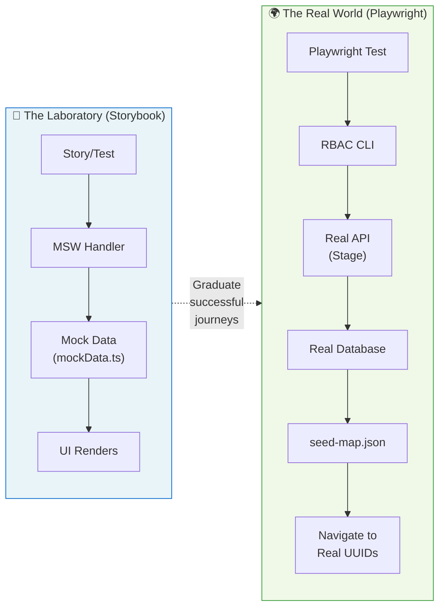
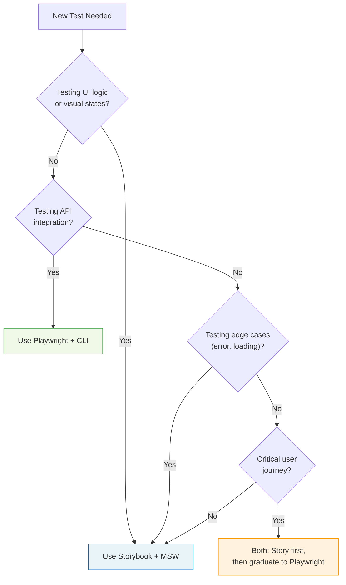

import { Meta } from '@storybook/addon-docs/blocks';

<Meta title="Documentation/E2E Testing Strategy" />

# E2E Testing Strategy

This document outlines our comprehensive testing approach—a dual-track strategy that combines the speed of mocked tests with the confidence of real end-to-end verification.

---

## 🧪 The Strategy: "The Laboratory vs. The Real World"

Our quality assurance relies on two complementary testing pillars, each optimized for different purposes:

### The Laboratory (Storybook + MSW)

> **Fast, deterministic, developer-focused.**

In the laboratory, we use **Mock Service Worker (MSW)** to intercept all network requests. This creates a controlled environment where:

- ✅ Tests run **instantly**—no network latency
- ✅ Every state is **reproducible**—loading, error, empty, success
- ✅ Developers get **immediate feedback** while coding
- ✅ Edge cases are **easy to simulate**—rate limits, timeouts, malformed data

**Best for testing:**
- How the UI handles different data states
- Component rendering and interactions
- Visual regression testing
- Accessibility verification

### The Real World (Playwright + CLI)

> **Full-stack integration, production confidence.**

In the real world, we use **Playwright** with our custom **RBAC CLI** to seed actual data into the staging environment. This validates:

- ✅ **API contracts**—the backend actually accepts what we send
- ✅ **Data persistence**—created resources exist and can be retrieved
- ✅ **Authentication flows**—sessions work end-to-end
- ✅ **Production readiness**—the complete system works together

**Best for testing:**
- CI/CD smoke tests before deployment
- Multi-step user journeys with real data
- Integration between frontend and backend
- Permission system verification

---

### Architecture Diagram



---

## 🌉 The Bridge: From Story to Spec

We follow a "progressive confidence" workflow:

1. **Build in Storybook** — Develop the UI with mocks, iterate quickly on design and edge cases
2. **Write Play Functions** — Add interaction tests that validate user journeys in the mocked environment
3. **Graduate to Playwright** — Once the journey is stable, create a real E2E spec using seeded data

This approach gives us the best of both worlds: rapid development velocity AND production confidence.

### Comparison Table

| Aspect | Storybook (MSW) | Playwright (CLI) |
|--------|-----------------|------------------|
| **Data Source** | `mockData.ts` handlers | `seed-map.json` from CLI |
| **Speed** | ⚡ Instant (~ms) | 🐢 Slower (~seconds for seed) |
| **Determinism** | 100% reproducible | Depends on environment state |
| **Best For** | DX, design, edge cases | CI/CD, smoke tests, contracts |
| **Network** | Intercepted by MSW | Real HTTP to staging |
| **Database** | None | Real staging database |
| **Setup Cost** | Zero | Requires auth + seed |
| **Debugging** | Storybook UI | Playwright trace viewer |

---

## 🛠️ The Tooling: `rbac-cli`

To make "The Real World" testing possible without flakiness, we built the **RBAC CLI**—a purpose-built tool that handles authentication and data management.

### Why We Need It

Traditional E2E tests suffer from:
- ❌ Hardcoded UUIDs that become stale
- ❌ Manual data setup that's error-prone
- ❌ Shared test data that causes conflicts
- ❌ No cleanup, leading to data pollution

The CLI solves these by providing:
- ✅ Automated authentication with storage state export
- ✅ Dynamic data seeding with UUID mapping
- ✅ Prefixed resources for isolation
- ✅ Safe cleanup with guardrails
- ✅ **Anti-Flake Layer** — Automatically blocks vendor consent overlays (TrustArc) to prevent false negatives

---

### Command Reference

#### `login --headless` — The Authentication Bridge

Performs automated SSO login and exports Playwright-compatible storage state.

```bash
# V1 Admin (org admin for User Access pages)
RBAC_USERNAME=your-admin RBAC_PASSWORD=your-pass \
  npm run cli -- login --headless --save-state e2e/auth/v1-admin.json

# V1 User (regular user for read-only tests)
RBAC_USERNAME=your-user RBAC_PASSWORD=your-pass \
  npm run cli -- login --headless --save-state e2e/auth/v1-user.json

# V2 Admin (org admin for Access Management pages)
RBAC_USERNAME=your-v2-admin RBAC_PASSWORD=your-pass \
  npm run cli -- login --headless --save-state e2e/auth/v2-admin.json

# V2 User (regular user for V2 read-only tests)
RBAC_USERNAME=your-v2-user RBAC_PASSWORD=your-pass \
  npm run cli -- login --headless --save-state e2e/auth/v2-user.json
```

**Dual-Proxy Support:**

The CLI automatically handles two networking scenarios:

| Environment | Variable | Use Case |
|-------------|----------|----------|
| **CI Pipeline** | `HTTPS_PROXY` | Sidecar proxy in CI/CD |
| **Local VPN** | `RBAC_PAC_URL` | Corporate VPN PAC file |

```bash
# CI sidecar proxy
HTTPS_PROXY=http://sidecar:8080 npm run cli -- login --headless

# Local VPN (macOS: find your PAC URL with `scutil --proxy`)
NODE_TLS_REJECT_UNAUTHORIZED=0 \
RBAC_PAC_URL="https://proxy.corp.redhat.com/proxy.pac" \
npm run cli -- login --headless
```

---

#### `seed --file --prefix --json --output [--dry-run]` — Data Injection

Creates resources and outputs a name→UUID mapping for test navigation.

```bash
# V1 tests: seed roles and groups (no workspaces)
npm run cli -- seed --file e2e/fixtures/seed-v1.json --prefix "ci-run-42-" --json --output e2e/seed-map.json

# V2 tests: seed roles, groups, and workspaces
npm run cli -- seed --file e2e/fixtures/seed-v2.json --prefix "ci-run-42-" --json --output e2e/seed-map.json

# Dry-run: authenticates and discovers system resources, but skips mutations
npm run cli -- seed --file e2e/fixtures/seed-v1.json --prefix "ci-run-42-" --dry-run
```

The `--output` flag writes the UUID map to a file while keeping stdout free for logs.

**Dry-run behavior:**
- ✅ Authenticates to the API (validates credentials work)
- ✅ Discovers system roles and groups (Phase 1 runs normally)
- ❌ Skips resource creation (Phase 2 outputs curl commands instead)

This lets you verify the seed configuration and see available system resources without creating anything.

**Payload Schema:**

```json
{
  "roles": [
    {
      "name": "analyst",
      "display_name": "Cost Analyst",
      "description": "Read-only access to cost data"
    }
  ],
  "groups": [
    {
      "name": "finance-team",
      "description": "Finance department users"
    }
  ],
  "workspaces": [
    {
      "name": "project-alpha",
      "description": "Alpha project workspace"
    }
  ]
}
```

**Output (`seed-map.json`):**

```json
{
  "roles": {
    "ci-run-42-analyst": "550e8400-e29b-41d4-a716-446655440001"
  },
  "groups": {
    "ci-run-42-finance-team": "550e8400-e29b-41d4-a716-446655440002"
  },
  "workspaces": {
    "ci-run-42-project-alpha": "550e8400-e29b-41d4-a716-446655440003"
  }
}
```

---

#### `cleanup --prefix` — Safe Teardown

Deletes resources matching a prefix. Protected by multiple safety rails.

```bash
# Cleanup all resources with prefix
npm run cli -- cleanup --prefix "ci-run-42-"

# Pattern matching
npm run cli -- cleanup --name-match "ci-*-test"
```

<div className="sb-unstyled" style={{
  backgroundColor: '#fdf3cd',
  border: '1px solid #ffc107',
  borderRadius: '8px',
  padding: '16px',
  marginTop: '16px'
}}>

### ⚠️ Safety Rails

The cleanup command is protected by multiple guardrails:

1. **Production Blocked** — The command will refuse to run if `RBAC_ENV=prod`
2. **Minimum Pattern Length** — Prefix must be ≥4 characters (prevents `*` or `test`)
3. **Protected Resources** — System roles and platform defaults are never deleted
4. **Root Workspace Protected** — The root workspace cannot be deleted

**Why won't this run on Prod?**

The CLI checks the `RBAC_ENV` environment variable. If it's `prod` or `production`, both `seed` and `cleanup` commands exit with an error:

```
❌ Cleanup is not allowed in production via headless mode.
This safety rail prevents accidental data deletion in production.
Set RBAC_ENV=stage to use the cleanup command.
```

</div>

---

## 🏗️ The Playwright Architecture

### The Seed Map Pattern

The key to stable E2E tests is **never hardcoding UUIDs**. Instead, we:

1. Seed data with the CLI before tests run
2. Export the name→UUID mapping to `seed-map.json`
3. Import the mapping in Playwright tests
4. Navigate to dynamically-generated URLs

**Example Test Structure:**

```typescript
// e2e/journeys/v1/roles/admin.spec.ts
import { test, expect } from '@playwright/test';
import { AUTH_V1_ADMIN, getPrefixedName, SEEDED_ROLE_NAME } from '../../../utils';

test.use({ storageState: AUTH_V1_ADMIN });

test.describe('V1 Roles (Admin)', () => {
  test('can search for seeded role', async ({ page }) => {
    await page.goto('/iam/user-access/roles');
    
    // Search for the prefixed seeded role
    const searchInput = page.getByPlaceholder(/search/i);
    await searchInput.fill(getPrefixedName(SEEDED_ROLE_NAME));
    
    await expect(page.getByText(getPrefixedName(SEEDED_ROLE_NAME))).toBeVisible();
  });

  test('can view role details', async ({ page }) => {
    await page.goto('/iam/user-access/roles');
    
    // Click on the seeded role to view details
    await page.getByText(getPrefixedName(SEEDED_ROLE_NAME)).click();
    
    await expect(page.getByRole('heading', { name: /Seeded Role/i }))
      .toBeVisible();
  });
});
```

---

### Multi-Persona Support

Different tests require different permission levels. We support this via separate storage state files for each API version:

| File | Persona | Use Case |
|------|---------|----------|
| `e2e/auth/v1-admin.json` | V1 Organization Admin | Full CRUD on User Access pages |
| `e2e/auth/v1-user.json` | V1 Regular User | Read-only tests on User Access pages |
| `e2e/auth/v2-admin.json` | V2 Organization Admin | Full CRUD on Access Management pages |
| `e2e/auth/v2-user.json` | V2 Regular User | Read-only tests on Access Management pages |

**Switching Personas in Tests:**

```typescript
// e2e/journeys/v1/roles/admin.spec.ts
import { AUTH_V1_ADMIN } from '../../../utils';

test.use({ storageState: AUTH_V1_ADMIN });

test('admin can create role', async ({ page }) => {
  await page.goto('/iam/user-access/roles');
  await page.getByRole('button', { name: 'Create role' }).click();
  // Admin can see the create button
});

// e2e/journeys/v1/roles/user.spec.ts
import { AUTH_V1_USER } from '../../../utils';

test.use({ storageState: AUTH_V1_USER });

test('regular user cannot create role', async ({ page }) => {
  await page.goto('/iam/user-access/roles');
  // Create button should not be visible for regular users
  await expect(page.getByRole('button', { name: 'Create role' }))
    .not.toBeVisible();
});
```

**Generating All Four Auth Files:**

```bash
# V1 Admin
RBAC_USERNAME=admin-user RBAC_PASSWORD=admin-pass \
  npm run cli -- login --headless --save-state e2e/auth/v1-admin.json

# V1 User
RBAC_USERNAME=regular-user RBAC_PASSWORD=user-pass \
  npm run cli -- login --headless --save-state e2e/auth/v1-user.json

# V2 Admin (may require different account with V2 feature flags)
RBAC_USERNAME=v2-admin RBAC_PASSWORD=admin-pass \
  npm run cli -- login --headless --save-state e2e/auth/v2-admin.json

# V2 User
RBAC_USERNAME=v2-user RBAC_PASSWORD=user-pass \
  npm run cli -- login --headless --save-state e2e/auth/v2-user.json
```

---

## 👨‍🍳 Developer Cookbook

### One-Shot Commands (Recommended)

Run the entire E2E lifecycle with a single command:

```bash
# V1 Admin tests (full CRUD on User Access pages)
TEST_PREFIX=jdoe RBAC_USERNAME=your-admin RBAC_PASSWORD=secret npm run e2e:v1:admin

# V1 User tests (read-only verification)
TEST_PREFIX=jdoe RBAC_USERNAME=your-user RBAC_PASSWORD=secret npm run e2e:v1:user

# V2 Admin tests (Access Management pages)
TEST_PREFIX=jdoe RBAC_USERNAME=your-v2-admin RBAC_PASSWORD=secret npm run e2e:v2:admin

# V2 User tests
TEST_PREFIX=jdoe RBAC_USERNAME=your-v2-user RBAC_PASSWORD=secret npm run e2e:v2:user
```

**What happens under the hood:**

1. **Auth** (`e2e:auth:*`) — Logs in via headless browser, saves session state
2. **Seed** (`e2e:seed`) — Creates test data with `TEST_PREFIX`, outputs UUID map
3. **Test** (`e2e:test:*`) — Runs the specific Playwright specs
4. **Cleanup** (`e2e:cleanup`) — Deletes all data matching `TEST_PREFIX`

### CI Pipeline

```bash
# Single command handles everything
TEST_PREFIX="ci-$CI_JOB_ID" \
RBAC_USERNAME=$CI_USER \
RBAC_PASSWORD=$CI_PASS \
npm run e2e:v1:admin
```

### Manual Workflow (Debugging)

When you need to run steps individually:

```bash
# Set environment once (prefix must be at least 4 characters)
export TEST_PREFIX=jdoe
export RBAC_USERNAME=your-admin
export RBAC_PASSWORD=secret

# Run primitives as needed
npm run e2e:auth:v1:admin    # Auth (once per session)
npm run e2e:seed             # Seed test data
npm run e2e:test:v1:admin    # Run tests (repeat while debugging)
npm run e2e:cleanup          # Cleanup when done
```

---

### Debug a Specific Test

```bash
# Run single test with UI mode
npx playwright test e2e/journeys/v1/roles/admin.spec.ts --ui

# Run with debug flag (step-through debugging)
npx playwright test e2e/journeys/v1/roles/admin.spec.ts --debug

# Run headed (visible browser)
npx playwright test e2e/journeys/v1/roles/admin.spec.ts --headed

# Generate trace for failed test
npx playwright test e2e/journeys/v1/roles/admin.spec.ts --trace on
```

**Viewing Traces:**

```bash
# Open trace viewer
npx playwright show-trace test-results/*/trace.zip

# View HTML report
npx playwright show-report
```

---

### View the Current Seed Map

The seed map is generated by the CLI and stored at your specified output path:

```bash
# View seed map
cat e2e/seed-map.json | jq

# Get specific UUID
cat e2e/seed-map.json | jq '.roles["ci-run-42-analyst"]'

# List all seeded role names
cat e2e/seed-map.json | jq '.roles | keys'
```

---

### Quick Reference Commands

**One-Shot (Full Lifecycle):**

| Command | Description |
|---------|-------------|
| `npm run e2e:v1:admin` | Auth → Seed → Test V1 Admin → Cleanup |
| `npm run e2e:v1:user` | Auth → Seed → Test V1 User → Cleanup |
| `npm run e2e:v2:admin` | Auth → Seed → Test V2 Admin → Cleanup |
| `npm run e2e:v2:user` | Auth → Seed → Test V2 User → Cleanup |

**Primitives (Individual Steps):**

| Task | Command |
|------|---------|
| Auth V1 Admin | `npm run e2e:auth:v1:admin` |
| Auth V1 User | `npm run e2e:auth:v1:user` |
| Auth V2 Admin | `npm run e2e:auth:v2:admin` |
| Auth V2 User | `npm run e2e:auth:v2:user` |
| Seed data | `npm run e2e:seed` |
| Cleanup | `npm run e2e:cleanup` |
| Test V1 Admin | `npm run e2e:test:v1:admin` |
| Test V1 User | `npm run e2e:test:v1:user` |
| Test V2 Admin | `npm run e2e:test:v2:admin` |
| Test V2 User | `npm run e2e:test:v2:user` |

**Debugging:**

| Task | Command |
|------|---------|
| Run specific test | `npx playwright test e2e/journeys/v1/roles/admin.spec.ts` |
| Headed mode | `npx playwright test --headed` |
| Debug mode | `npx playwright test --debug` |
| UI mode | `npx playwright test --ui` |
| View report | `npx playwright show-report` |

---

## 📊 When to Use Which Approach



---

## 🔗 Related Documentation

- [Storybook Guide](./StorybookGuide.mdx) — How to write effective component stories
- [Permissions & Context Testing](./PermissionsContext.mdx) — Testing with different user roles
- [Architecture](./Architecture.mdx) — Overall project architecture
- [CLI README](/src/cli/README.md) — Complete CLI documentation

---

**Happy testing!** 🧪

Use the laboratory for speed, the real world for confidence, and the CLI to bridge them both.
